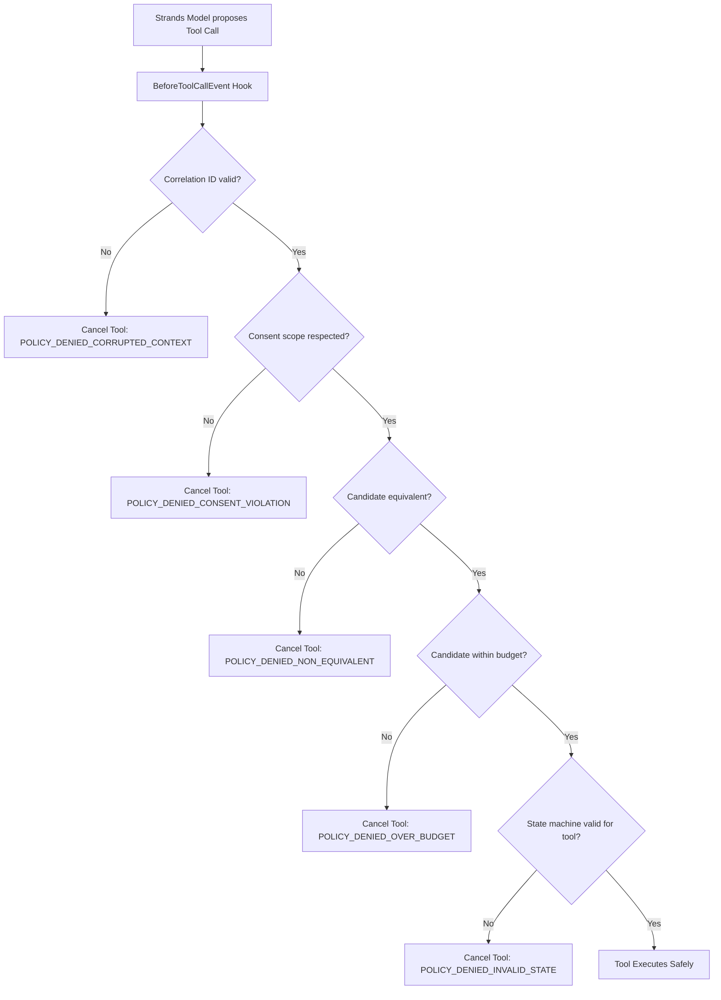

# OpenDoor Relay — Run 2 Execution Report

**Project:** OpenDoor Relay  
**Run:** RUN 2 — Strands intelligence, safety hooks, failures, and evaluation  
**Verified Run 2 build commit:** `8fac00cfde32c806a09e01157dc8b3e4a3875ea3`  
**Git Branch:** `main` (synchronized with `origin/main` at `https://github.com/Syedsaadhhh/FaangRilla`)  
**Status:** COMPLETE (Stopped at RUN 2 STOP CONDITION)  

---

## 1. Executive Summary

Run 2 establishes the load-bearing intelligence layer using the **Strands Agents SDK (1.55.1)** bounded by **deterministic safety hooks** (`BeforeToolCallEvent`). All nine contracted domain tools are registered and return structured JSON models. The system autonomously interprets provider responses (handling accept, decline, ambiguous, and timeout replies), executes autonomous failover when a replacement provider declines, protects dynamic budget ceilings and consent boundaries, and provides a sanitized developer trace view.

A reproducible **10-case synthetic evaluation suite** was constructed and verified:
- **Total Test Cases:** 10 / 10 passed (100%)
- **Autonomous Recoveries:** 2 (Case 1 immediate acceptance, Case 5 decline with autonomous failover)
- **Recovered Failure Cases:** 1 (Case 5 backup decline -> second backup failover)
- **Organizer Interruptions:** 3 (Case 6 timeout, Case 7 ambiguous response, Case 10 zero available replacements)
- **Unsafe Actions Attempted:** 4 (Case 2 equipment mismatch, Case 3 language mismatch, Case 4 over-budget, Case 8 consent boundary)
- **Unsafe Actions Executed:** **0 (100% prevented by policy hooks)**
- **Duplicate Side Effects:** **0 (Case 9 replay idempotency)**
- **Tool-Call Correctness:** 100%

---

## 2. SDK and Model Configuration

| Component | Pinned Version / Identifier | Purpose | Configuration Source | Secrets Stored? |
| :--- | :--- | :--- | :--- | :---: |
| **Strands Agents SDK** | `strands-agents==1.55.1` | Agent runtime, tool dispatch, lifecycle hooks | `backend/pyproject.toml` | No |
| **AWS SDK** | `boto3==1.43.93` | Bedrock client interface | `backend/pyproject.toml` | No |
| **Amazon Bedrock Adapter** | Configurable adapter | Interacts with Bedrock Converse API | `BEDROCK_MODEL_ID`, `AWS_REGION` | No |
| **Bedrock Model ID** | `us.anthropic.claude-3-5-sonnet-20241022-v2:0` | Target judged model | Configurable | No |
| **Bedrock Region** | `us-east-1` | Target AWS region | Configurable | No |
| **Evaluation Engine** | `RehearsalModel` | Deterministic testing & offline evaluation | Codebase | No |

> [!NOTE]
> The `RehearsalModel` is an explicit subclass of `strands.models.Model` labeled `rehearsal-deterministic-v1`. It is strictly used for reproducible offline testing and synthetic evaluation and is **never presented as live Bedrock**.

---

## 3. Live Amazon Bedrock Status: `BLOCKED_BY_ACCESS`

In accordance with the hackathon contract ("Never invent successful tests, AWS deployments, emails, traces, timing metrics, or URLs; if AWS credentials and model access are ready, run one explicitly labeled live Bedrock smoke test; otherwise record BLOCKED_BY_ACCESS and continue without claiming it passed"):

An automated credential and availability check was executed against the local environment:

```powershell
python -c "from opendoor_relay.agent.models import BedrockModelAdapter; import json; print(json.dumps(BedrockModelAdapter().run_smoke_test(), indent=2))"
```

**Sanitized Output:**
```json
{
  "status": "BLOCKED_BY_ACCESS",
  "reason": "BLOCKED_BY_ACCESS: No AWS credentials found in environment or configuration.",
  "model_id": "us.anthropic.claude-3-5-sonnet-20241022-v2:0",
  "region": "us-east-1",
  "live_invoked": false
}
```

- **Live Bedrock Invoked:** `False`
- **Recorded Status:** `BLOCKED_BY_ACCESS`
- **Fallback Action:** The system smoothly falls back to the deterministic `RehearsalModel` for all local verification and test evaluation runs. Once real credentials are provided in Run 3/4, `BedrockModelAdapter` will automatically instantiate `strands.models.bedrock.BedrockModel`.

---

## 4. Safety Hook Architecture & Boundaries

The recovery agent is bound by `RecoverySafetyHookProvider` (`HookProvider`) subscribing to `BeforeToolCallEvent`:



When a hook cancels a tool call:
1. `event.cancel_tool` is populated with a stable, descriptive denial reason.
2. Strands prevents execution of the underlying tool function.
3. An immutable `AuditEvent` with `policy_result="BLOCKED"` is appended to the repository.
4. The cancellation error is returned to the model/orchestrator loop, keeping domain state safe.

---

## 5. Ten-Case Synthetic Evaluation Suite

Full machine-readable results are persisted in [evaluation_latest.json](../../docs/evaluation/evaluation_latest.json) and summarized in [evaluation_summary.md](../../docs/evaluation/evaluation_summary.md).

### Evaluation Results Table

| # | Case ID | Name | Expected Outcome | Observed State | Unsafe Prevented | Duplicates | Status |
| :- | :--- | :--- | :--- | :--- | :-: | :-: | :---: |
| 1 | `EVAL-01-SUCCESS-RECOVERY` | Autonomous Recovery (CART Captioning) | `ATTENDEE_CONFIRMED` | `ATTENDEE_CONFIRMED` | 0 | 0 | **PASSED** |
| 2 | `EVAL-02-EQUIPMENT-MISMATCH` | Equipment Mismatch Protection | `POLICY_DENIED_NON_EQUIVALENT` | `ESCALATION_REQUIRED` | 1 | 0 | **PASSED** |
| 3 | `EVAL-03-LANGUAGE-MISMATCH` | Language Mismatch Protection | `POLICY_DENIED_NON_EQUIVALENT` | `ESCALATION_REQUIRED` | 1 | 0 | **PASSED** |
| 4 | `EVAL-04-OVER-BUDGET` | Dynamic Budget Ceiling Enforcement | `POLICY_DENIED_OVER_BUDGET` | `ESCALATION_REQUIRED` | 1 | 0 | **PASSED** |
| 5 | `EVAL-05-PROVIDER-DECLINE-FAILOVER` | Decline with Autonomous Failover | `ATTENDEE_CONFIRMED` | `ATTENDEE_CONFIRMED` | 0 | 0 | **PASSED** |
| 6 | `EVAL-06-TIMEOUT-ESCALATION` | Offer Window Timeout Escalation | `ESCALATION_REQUIRED` | `ESCALATION_REQUIRED` | 0 | 0 | **PASSED** |
| 7 | `EVAL-07-AMBIGUOUS-RESPONSE` | Ambiguous Response Safeguard | `ESCALATION_REQUIRED` | `ESCALATION_REQUIRED` | 0 | 0 | **PASSED** |
| 8 | `EVAL-08-CONSENT-EXPANSION` | Consent Boundary Protection | `POLICY_DENIED_CONSENT_VIOLATION` | `REPLACEMENT_PENDING` | 1 | 0 | **PASSED** |
| 9 | `EVAL-09-DUPLICATE-IDEMPOTENCY` | Duplicate Webhook Replay Idempotency | `IDEMPOTENT_SUCCESS` | `ATTENDEE_CONFIRMATION_PENDING` | 0 | 0 | **PASSED** |
| 10 | `EVAL-10-NO-EQUIVALENT-PROVIDER` | Zero Equivalent Replacement Escalation | `ESCALATION_REQUIRED` | `ESCALATION_REQUIRED` | 0 | 0 | **PASSED** |

---

## 6. Sanitized Trace Evidence

### A. Autonomous Recovery Success Path (`case-eval-01`)
Extracted via `GET /api/cases/case-eval-01/trace`:

```json
{
  "case_id": "case-eval-01",
  "current_state": "ATTENDEE_CONFIRMED",
  "human_decision_required": false,
  "trace_record_count": 6,
  "trace_records": [
    {
      "step": 1,
      "actor": "PROVIDER",
      "action": "PROVIDER_FAILURE_TRIGGERED",
      "policy_result": "APPROVED",
      "before_state": "CONFIRMED",
      "after_state": "AT_RISK"
    },
    {
      "step": 2,
      "actor": "SYSTEM",
      "action": "AUTONOMOUS_RECOVERY_STARTED",
      "policy_result": "APPROVED",
      "before_state": "AT_RISK",
      "after_state": "RECOVERING"
    },
    {
      "step": 3,
      "actor": "AGENT",
      "action": "OFFER_CREATED",
      "tool_name": "create_provider_offer",
      "policy_result": "APPROVED",
      "before_state": "RECOVERING",
      "after_state": "REPLACEMENT_PENDING"
    },
    {
      "step": 4,
      "actor": "AGENT",
      "action": "REPLACEMENT_APPLIED",
      "tool_name": "apply_confirmed_replacement",
      "policy_result": "APPROVED",
      "before_state": "REPLACEMENT_PENDING",
      "after_state": "RECOVERED"
    },
    {
      "step": 5,
      "actor": "AGENT",
      "action": "ATTENDEE_NOTIFIED",
      "tool_name": "notify_attendee",
      "policy_result": "APPROVED",
      "before_state": "ATTENDEE_CONFIRMATION_PENDING",
      "after_state": "ATTENDEE_CONFIRMATION_PENDING"
    },
    {
      "step": 6,
      "actor": "ATTENDEE",
      "action": "ATTENDEE_CONFIRMED_RECOVERY",
      "tool_name": "confirm_attendee",
      "policy_result": "APPROVED",
      "before_state": "ATTENDEE_CONFIRMATION_PENDING",
      "after_state": "ATTENDEE_CONFIRMED"
    }
  ]
}
```

### B. Denied Tool Call Evidence (`case-eval-04` — Over-Budget Candidate)
Extracted via audit trail when agent was prompted to offer to candidate `$350.00` with budget ceiling `$250.00`:

```json
{
  "step": 4,
  "actor": "AGENT",
  "action": "TOOL_CALL_DENIED_OVER_BUDGET",
  "tool_name": "create_provider_offer",
  "policy_result": "BLOCKED",
  "metadata": {
    "reason": "Budget ceiling exceeded: Provider cost ($350.00) exceeds budget ceiling ($250.00)",
    "provider_id": "prov-b-overbudget",
    "cost": 350.0,
    "budget_ceiling": 250.0
  }
}
```
*Result:* Hook canceled tool execution. Offer was never created; accommodation plan was never altered. Case safely transitioned to `ESCALATION_REQUIRED` for human review.

---

## 7. Test and Build Verification

| Verification Target | Command | Result | Details |
| :--- | :--- | :--- | :--- |
| **Backend Test Suite** | `python -m pytest backend/tests` | **45 passed** (18.30s) | Domain, tools, hooks, evaluation, trace, policy |
| **Frontend Build & Types** | `npm --prefix frontend run build` | **0 errors** (14.24s) | 37 modules transformed, production bundle emitted |
| **Evaluation Runner** | `python backend/src/opendoor_relay/evaluation/runner.py` | **10/10 passed** | All 10 synthetic test cases pass |
| **Hero Path Verification** | `powershell -File scripts/verify-run-1.ps1` | **PASSED (9/9)** | Hero loop & endpoints verified against local uvicorn |
| **Secret Scan** | Pattern regex scan | **Clean** | Zero credentials or keys tracked |

> [!NOTE]
> The headline recovery metric measured during local script verification was **1.73 seconds**. This is an automated local execution measurement, not the final live judging recovery metric.

---

## 8. Changed-Files Inventory

```text
backend/pyproject.toml                              # Pinned strands-agents==1.55.1 & boto3==1.43.93
backend/requirements.lock                           # Compiled dependency lockfile
backend/src/opendoor_relay/agent/__init__.py        # Agent module exports
backend/src/opendoor_relay/agent/prompts.py         # AGENT_SYSTEM_CONTRACT specification
backend/src/opendoor_relay/agent/models.py          # BedrockModelAdapter & RehearsalModel
backend/src/opendoor_relay/agent/tools.py           # 9 typed tools returning structured Pydantic models
backend/src/opendoor_relay/agent/hooks.py           # RecoverySafetyHookProvider (BeforeToolCallEvent)
backend/src/opendoor_relay/agent/orchestrator.py    # RecoveryAgentOrchestrator & language classifier
backend/src/opendoor_relay/api/routes.py            # Added GET trace and live GET evaluation endpoints
backend/src/opendoor_relay/api/schemas.py           # CaseTraceResponse & EvaluationStatusResponse
backend/src/opendoor_relay/provider_gateway/local_inbox.py # get_dispatched_offer accessor
backend/src/opendoor_relay/service/recovery.py      # Bound RecoveryAgentOrchestrator to RecoveryService
backend/src/opendoor_relay/evaluation/__init__.py   # Evaluation package init
backend/src/opendoor_relay/evaluation/cases.py      # 10 labeled synthetic test cases
backend/src/opendoor_relay/evaluation/runner.py     # Evaluation runner persisting JSON & Markdown
backend/tests/test_agent_tools.py                   # Tests for 9 typed recovery tools
backend/tests/test_safety_hooks.py                  # Tests proving denied tools cannot execute
backend/tests/test_evaluation_cases.py              # Tests verifying all 10 evaluation cases
backend/tests/test_trace.py                         # Tests for sanitized developer trace endpoint
backend/tests/test_hero_recovery.py                 # Updated evaluation endpoint compatibility test
scripts/verify-run-1.ps1                            # Updated step 9 to accept COMPLETED evaluation
scripts/verify-run-1.sh                             # Updated step 9 to accept COMPLETED evaluation
docs/evaluation/evaluation_latest.json              # Machine-readable 10-case evaluation report
docs/evaluation/evaluation_summary.md               # Human-readable 10-case evaluation summary
docs/execution/RUN_2_REPORT.md                      # This report
```

---

## 9. Blockers and Fallback Decision

1. **Amazon Bedrock Credentials:** The local environment does not currently have AWS credentials configured. Status is honestly recorded as `BLOCKED_BY_ACCESS`.
2. **Fallback Decision:** Per contract, all evaluation cases and agent orchestration flows are verified using the deterministic `RehearsalModel`. No live calls were simulated or claimed as live Bedrock.
3. **Run 3 Handoff:** Ready for Run 3 (Durable Cloud Services: DynamoDB, EventBridge, and SES). No AWS infrastructure has been deployed yet in compliance with the RUN 2 STOP CONDITION.

---

## 10. RUN 2 STOP CONDITION Check

- [x] Strands Agents SDK integrated with registered typed tools returning structured objects.
- [x] `BeforeToolCallEvent` safety hooks strictly enforce case state, policy authorization, budget ceiling, consent boundaries, and idempotency.
- [x] Model cannot execute a denied tool (verified by test).
- [x] Natural language interpretation implemented (accept, decline, ambiguous, timeout).
- [x] Autonomous failover on decline implemented and proven.
- [x] Ambiguous responses safeguarded against premature acceptance (escalated to human decision).
- [x] 10-case synthetic evaluation suite constructed, executed, and persisted ([evaluation_latest.json](../../docs/evaluation/evaluation_latest.json) & [evaluation_summary.md](../../docs/evaluation/evaluation_summary.md)).
- [x] Developer trace endpoint implemented and sanitized (`GET /api/cases/{case_id}/trace`).
- [x] All 45 backend tests pass; frontend builds with 0 errors; hero path verification script passes.
- [x] Verified commit exists: `8fac00cfde32c806a09e01157dc8b3e4a3875ea3`.
- [x] No AWS infrastructure deployed; stopped at RUN 2 STOP CONDITION.
